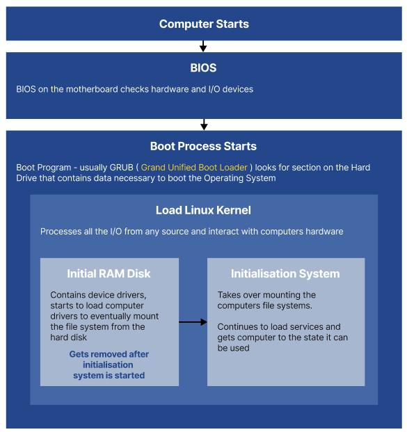
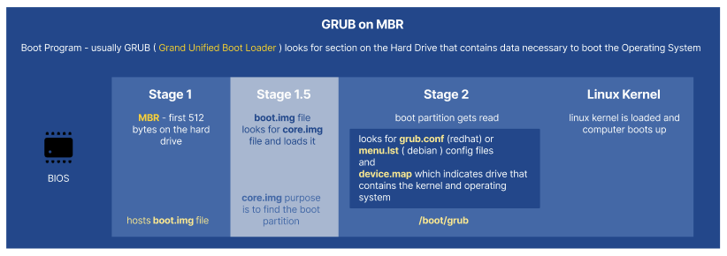
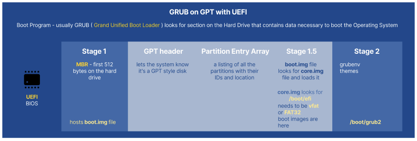

``# Linux

- [Sources](#sources)
- [Linux Boot Process](#linux-boot-process)
      - [BIOS / UEFI](#bios--uefi)
      - [Boot Loader](#boot-loader)
      - [kernel Initialisation](#kernel-initialisation)
      - [System Initialisation](#system-initialisation)
  - [What is a Daemon?](#what-is-a-daemon)
  - [Boot Options](#boot-options)
  - [Boot File Location](#boot-file-location)
  - [Boot Modules and Files](#boot-modules-and-files)
  - [Boot Logs](#boot-logs)
  - [Legacy GRUB](#legacy-grub)
    - [Installing Legacy GRUB](#installing-legacy-grub)
  - [GRUB2](#grub2)
    - [GRUB2 Configuration Commands](#grub2-configuration-commands)
  - [Difference Between `MBR` and `GPT`](#difference-between-mbr-and-gpt)
  - [Interacting with GRUB](#interacting-with-grub)
    - [initramfs](#initramfs)
- [Install, Configure and Monitor Kernel Modules](#install-configure-and-monitor-kernel-modules)
  - [Interacting with Kernel Modules](#interacting-with-kernel-modules)
  - [Kernel Module File Location](#kernel-module-file-location)
- [Configure and Verify Network Connection Parameters](#configure-and-verify-network-connection-parameters)
  - [Network Fundamentals](#network-fundamentals)
  - [Network Device Naming](#network-device-naming)
  - [Network Bonding and Link Aggregation](#network-bonding-and-link-aggregation)
    - [Bonding Modes](#bonding-modes)
  - [Interacting with Network](#interacting-with-network)
    - [Interacting with Network Interfaces, Connections and Packets](#interacting-with-network-interfaces-connections-and-packets)
    - [Interacting with DNS](#interacting-with-dns)
  - [Network File Location](#network-file-location)
- [Manage Storage in a Linux Environment](#manage-storage-in-a-linux-environment)
  - [Pseudo File Systems](#pseudo-file-systems)
    - [Primary Pseudo File systems in Linux](#primary-pseudo-file-systems-in-linux)
  - [Main File System File Location](#main-file-system-file-location)
    - [Swap Space](#swap-space)
  - [File System Hierarchy Standards](#file-system-hierarchy-standards)
  - [Partitions and Mount Points](#partitions-and-mount-points)
  - [File System Types](#file-system-types)
  - [Interacting with File System](#interacting-with-file-system)
  - [File System File Location](#file-system-file-location)

# Sources

[The Complete Ubuntu Linux Server Administration Course !](https://www.udemy.com/course/the-complete-ubuntu-linux-server-administration-course/) by [Prashant Shinde](https://www.udemy.com/user/shindeprashant/)

[aCloudGuru CompTIA Linux+ XK0-004 Certification Exam](https://acloud.guru/overview/7b9017a5-fdb9-40ef-89ee-48da90887b4e)

# Linux Boot Process



#### BIOS / UEFI

`BIOS` - Basic Input Output System - firmware on the motherboard used to initialise hardware.

`POST` - Power On Self Test - a process that ensures that all connected devices are initialised and responding before passing the control to Boot Loader

`UEFI` - Unified Extensible Firmware Interface - new integration of BIOS with additional capabilities

> Once POST is complete, the system locates the Boot Loader and loads it into memory

#### Boot Loader

`Boot Loader` - program that loads the operating system for the computer. It's configured with the location of the desired Operating System kernel that it loads into memory

> GRUB2 is the most used boot loader, referred to as GRUB

#### kernel Initialisation

Loaded kernel extracts itself from a compressed image ( located in `/boot` ) and then loads the system initialisation daemon.

> System initialisation daemon is `systemd` ( used to be `sysv-init` )

Once the kernel and system initialisation daemon are running, the system can start

#### System Initialisation

`systemd` mounts devices located in `fstab` and proceeds to boot the system into the default run level. Once the process has been completed, the system is considered booted.

## What is a Daemon?

- Stands for **Disk and Execution Monitor**
- Long-running background process that answers requests for services
- By convention, daemon names are ending with **d** (sshd, httpd etc.)

## Boot Options

**Boot from ISO** - uses an ISO image that is mounted as a drive to load the kernel

**PXE ( Pre EXecutable environment)** - client environment that searches for a server on the network from which to acquire a boot image. Once found, it's downloaded via trivial file transfer protocol ( TFTP )

**Boot from HTTP/HTTPS** - allows the image to be loaded using standard network protocols

## Boot File Location

Most of the files that are related to the boot process are stored in the `/boot` directory

> Exceptions might be GRUB files, they can be located in different places, depending on the BIOS/UEFI.

Most common locations for GRUB files:

`/etc/grub`

`/etc/grub2.cfg`

`/boot/grub`

`/boot/grub2`

`/etc/efi`

## Boot Modules and Files

The following commands are executed to create necessary files and enable the system to boot

`mkinitrd` - make init ramdisk - creates the initial ramdisk that is used by the kernel to preload block devices that are needed to access the root file system

`grub2-install` - installs the GRUB2 boot loader onto a device, includes necessary images and creates the boot sector

`grub2-mkconfig` - creates configuration file for GRUB2 boot loader

Additional commands for booting the system are

`initramfs` - complete set of root file system directories, bundled into a `cpio` archive and compressed

`efi` files - used by the UEFI boot loader and comprise the EFI partition, usually located under `/boot/efi`

`vmlinuz` - Virtual Memory Linux gZip - Linux kernel executable, a compressed kernel that is capable of loading the operating system into the memory

`vmlinux` - Virtual Memory Linux - a statically linked executable file that contains the Linux kernel, it can be used in debugging. The difference with the `vmlinuz` is that this file is not compressed

## Boot Logs

> Once the computer is rebooted, boot logs are removed and logs from the next boot are written into the same location

> Boot Logs are generated by kernel Ring Buffer

`kernel Ring Buffer` - section of memory where kernel writes all of its system messages to

`dmesh` - command to view kernel ring buffer logs. It shows what hardware the kernel can see, how it activates it and low-level memory management messages.

`dmesh` command is considered legacy and replaced by **`journalctl -k`** command.

## Legacy GRUB

`MBR` - Master Boot Record - information in the first sector of any hard disk that identifies how and where an operating system is located



**STAGE 1**

GRUB Boot Loader has a small image file called `boot.img` located on the MBR, the hard disk where `boot.img` is located **is marked with the boot flag**

**STAGE 1.5**

`boot.img` file looks for the `core.img` file that is located towards the beginning of the drive

> `core.img` file is responsible for finding the boot partition on the system.

**STAGE 2**

The boot partition is read in `/boot/grub`. Legacy GRUB is looking for either `grub.conf` or `menu.lst` files. Both of these files store the same information.

- `grub.conf` - redhat based distributions
- `menu.lst` - debian based distributions

The other file that GRUB looks for is `device.map`, which indicates which drive contains the kernel and the Operating System that needs to be booted. When the file is read, the Linux kernel is loaded by GRUB

### Installing Legacy GRUB

```sh
grub-install $DEVICE_NAME

# to find a device that you can install grub on
findmnt /boot

# to install
grub-install /dev/vda1
grub-install '(hd0)'

# to view bios drive information for grub location
grub # invokes the GRUB
grub> find /grub/stage1
```

## GRUB2



### GRUB2 Configuration Commands

redhat - `grub2-$command`

debian - `grub-$command`

`grub-editenv list` - view the default boot entry for the `GRUB` config file

`grub-mkconfig` - creates or updates `/boot/grub2/grub.cfg` file based on entries from `/etc/default/grub` file

`update-grub` - used to update GRUB2 configuration after changes to `/etc/default/grub` file have been made.

> `update-grub` is the default option on Debian based systems

> `/etc/grub.d` contains the configuration files for different sections

## Difference Between `MBR` and `GPT`

`MBR` - Master Boot Record

- Supports only 26 total partitions
  - 4 physical partitions
  - one of the physical partitions is extended to 23 logical partitions
- Supports partition size up to 2TB

`GPT` - GUID Partition Table

- Supports 128 partitions
- Supports partitions size in ZB ( Zetta Byte ) range
- Requires `UEFI` ( Unified Extensible Firmware Interface ) to boot
  - replaces traditional BIOS, can act in legacy BIOS mode
  - requires 64bit Operating System
  - prevents unauthorised Operating Systems from booting on the system

## Interacting with GRUB

`setup (hd0)` - installs / reinstalls `GRUB` onto first hard drive

RedHat - you need to append a run-level number at the end of the kernel command line

```sh
<TYPE=pc KEYTABLE=us rd_NO_DM rhgb quiet 2
```

Debian - systemd specific command to boot into different target

```sh
linux /boot/vmlinuz-4.13.0-43-generic root=UUID=$ID ro systemd.unit=rescue.target
```

### initramfs

`lsinitrd` - allows viewing the content of the `initramfs` file

`dracut` - create a new `initramfs` for the kernel on the system that is used to preload the block device modules.

# Install, Configure and Monitor Kernel Modules

`kernel` - core framework of the Operating System

> `kernel` provides a way for the system to operate with hardware, memory, networking and itself ( kernels' subsystem )

Linux kernel is monolithic:

- handles all memory management and hardware device interactions
- extra functionality can be loaded and unloaded dynamically, through kernel modules
- system does not need to be rebooted into a different kernel image for added functionality

> kernel modules most often are third party drivers

**GNU/Linux**

`GNU` - tools that can be used on the system

`Linux` - Linux kernel

## Interacting with Kernel Modules

`uname` - displays information about the currently running kernel

`lsmod` - displays a list of all currently loaded kernel modules

`modinfo` - displays information about a specific kernel module

`modprobe` - dynamically loads and unloads kernel modules at runtime

`rmmod` - removes kernel module from a running kernel

`insmod` - insert a module from a directory into the running kernel. **This command does not take into account module dependencies**

`depmod` - generates a list of kernel dependencies and map files

## Kernel Module File Location

`/lib/modules/$(uname -r)/` - location of kernel modules that are specific to the current kernel version

`/usr/lib/modules` - parent location for module storage

`/etc/modprobe.conf` - the file that contains the options that can be configured for modprobe. **This file is scheduled to be deprecated**

# Configure and Verify Network Connection Parameters

## Network Fundamentals

Refer to [Network Fundamentals](/fundamentals/network.md) page

## Network Device Naming

`en` - ethernet

`wl` - wireless

`eno1` - **o** - for **onboard** devices, index provided by BIOS or firmware

`ens1` - **s** - for devices in PCI Express hot-plug **slots**, index provided by BIOS or hardware

`enp2s0` - **p** - for devices in specific **physical** locations

## Network Bonding and Link Aggregation

> `network bonding` - grouping multiple network interfaces and using them as one

> `network briding` - combining 2 or more networks into one logical network

### Bonding Modes

`Mode=1` - active-backup policy - all interfaces are in the backup state while one remains active

`Mode=2` - XOR policy - the interface is selected based on the result of an XOR operation

`Mode=4` - IEEE 802.3ad policy - interfaces that are in the same aggregation groups share the speed and duplex settings

`Mode=5` - adaptive transmit load balancing policy - outgoing traffic distribution is according to the load on each interface, the current interface receives all incoming traffic

## Interacting with Network

### Interacting with Network Interfaces, Connections and Packets

`nmcli` - Network Manager binary

```sh
nmcli dev show # show physical hardware that is used to connect to the network
nmcli con show # show network configuration for a particular device
nmcli dev status # check status of network cards
nmnli con down $CONNECTION_NAME # take a network connection down
nmcli con down $CONNECTION_NAME # bring a network connection up

nmcli con \
  add con-name $CONNECTION_NAME \
  type ethernet ipv4 $IP_ADDRESS \
  gw4 $GW_ADDRESS \
  ifname $NETWORK_CARD_DEVICE_NAME autoconnect # create a new connection

nmcli con edit # enter configuration manager
```

`netstat` - Show network status-related information

> requires **net-tools**

```sh
netstat # show active connections
netstat -a # show all connections
netstat -au # show all UDP connections
netstat -at # show all TCP connections
netstat -tulp # show what processes are listening on what TCP and UDP ports
netstat -tulpe # show what processes are listening on what TCP and UDP ports + user information

netstat -r # show routing information
netstat -rn # show routing information with IPs

netstat -i # show interface information
netstat -ie # show extended interface information
```

`tcpdump` - show packet information

```sh
tcpdump -D # show available interfaces
tcpdump -i $INTERFACE_NAME # show packets that are going through an interface
# .pcap - packet capture
tcpdump -w $FILE_NAME.pcap -i $INTERFACE_NAME # write packets from interface to a file
tcpdump -r $FILE_NAME.pcap # read saved packet information
```

### Interacting with DNS

`nslookup` - query the DNS system

```sh
nslookup $DOMAIN_NAME
nslookup -query=mx $DOMAIN_NAME
nslookup -query=ns $DOMAIN_NAME
nslookup -query=any $DOMAIN_NAME
nslookup -port=$PORT_NUMBER $DOMAIN_NAME
```

`dig` - Domain Information Groper - allows to query DNS servers and perform DNS lookups

```sh
dig $DOMAIN_NAME # show full information regarding dns records
dig $DOMAIN_NAME $RECORD_TYPE # query for specific record type
dig $DOMAIN_NAME $RECORD_TYPE +short # show either IPs or DNS names that are returned
dig $DOMAIN_NAME $RECORD_TYPE +short $DOMAIN_NAME $RECORD_TYPE +short # query multiple domains
```

`host` - simple DNS lookup

```sh
host -t $RECORD_TYPE $DOMAIN_NAME # show specified record type
host $DOMAIN_NAME # show ip address information for the domain
```

## Network File Location

`/etc/sysconfig/network-scripts/` - network interface configuration scripts get used to manipulate the network interfaces.

`/etc/sysconfig/network/` - more general network configurations that are not specific to an interface.

`/etc/hosts` - the file that is the store for local DNS resolution.

`/etc/network` - the location of the network configuration files.

`/etc/nsswitch.conf` - the file that is used to determine the sources from which to obtain name service information.

`/etc/resolv.conf` - the file that contains the list of external DNS servers.

`/etc/netplan` - the location of files that can be used to configure networking on newer systems.

`/etc/sysctl.conf` - used to override default kernel parameter values.

`/etc/dhcp/dhclient.conf` - used to configure the DHCP client.

# Manage Storage in a Linux Environment

## Pseudo File Systems

`regular file system` - lays out file and folders on a physical hard drive

`pseudo file system` - does not exist on the hard drive, **it's created in RAM while the system is running**

### Primary Pseudo File systems in Linux

`/proc` - contains information about the processes running on the system. Also contains some metadata like `cpuinfo`, `meminfo`, `partitions`, `uptime`, `version` etc.

`/sys` - contains information about the systems hardware and kernel modules.

## Main File System File Location

`/` - root directory

`/var` - variable , log files and dynamic content

`/home` - users' home directory

`/boot` - Linux Kernel and supporting files

`/opt` - _optional_ software, used by third party software wendors. Extensively used in enterprise

### Swap Space

> temporary storage that acts like RAM

- when a percentage of RAM is full, kernel will move less used data to `swap`

usually, `swap` is put into a separate partition. the swap size should not be less then 50% of the available RAM

## File System Hierarchy Standards

> Linux is a single root Operating System

`/` - root directory

`/bin` - user binaries

`/boot` - files necessary to get the system booted up and kernel

`/dev` - device references

`/etc` - system service configuration

`/home` - users' home directory

`/lib` and `/lib64` - application code that is shared across multiple apps on the system

`/media` - mount location for external media

`/mnt` - mount location for other hard drives

`/opt` - alternative to `/bin` for binaries and apps

`/proc` - information about the running Linux system

`/root` - home directory of the **`root`** user

`/sbin` - system administrator tools and apps

> usually only **`root`** user has access to `/sbin`

`/srv` - server applications ( web servers, etc. )

`/tmp` - application temporary data

`/var` - log, printer files etc.

## Partitions and Mount Points


`sd` - sata disk, `xvd` - virtual disk

`a` - first disk

`1` - first partition

## File System Types

`ext3` - 3rd extended file system, introduced in 2001, includes journaling. Limited by individual file size of 2 TB and an overall system size of 32 TB

`ext4` - 4th extended file system, introduced in 2008, includes journaling. Allows individual file sizes of up to 16 TB and an overall system size of 1 EB ( Exabyte )

`xfs` - ported to Linux in 2014, 64bit file system, includes journaling. Great support for parallel

`nfs` - Network File System - client/server file system that allows file access across network

`smb` - Server Message Block - network protocol allowing network access to files and other network resources

`cifs` - Common Internet File System - version of smb

`ntfs` - proprietary journaling file system created by Microsoft. Default file system on modern versions of Windows Operating System

## Interacting with File System

`iostat` - reports CPU and I/O stats

`lsblk` - lists block devices

`blkid` - reports block device metadata

> block device is any device that can take large amount of data

`fdisk` - manages device partitions. **Does NOT work with partitions larger then 2 TB**

> requires sudo

<!-- TODO: add more on fdisk? -->

```sh
fdisk -l # show information on all mounted drives
fdisk -l /dev/$DRIVE_NAME # on specific drive

fdisk /dev/$DRIVE_NAME # create a new partition on the drive, brings up a wizard
# m - list possible actions
# p - print existing partitions
# l - change partition type
# n - create a new partition
```

`parted` - manages device partitions. **Does not have any limitation for partition size**

`mkfs` - Make File System - builds a file system or a partitioned device ( usually a disk drive )

`df` - Disk Free - reports free space on the file system that is passed to it.

> when no arguments - lists the system

```sh
df -ahT # show full information including file system type
df -ahT $PATH # show full information including file system type for a specific path
```

`du` - Disk Used - reports the size of the file pased to the commend

> when no arguments - lists the file size of all files on the system

```sh
du -ha $PATH # show size for all files and directories
du -hs $PATH # show only the size of the dir/file of path specified
```

## File System File Location

`/etc/fstab` - File System Table - contains information necessary to allow automatic mounting of devices

`/etc/crypttab` - contains information for encrypted devices that are set up during system boot

`/dev/` - device files for all devices on the system

`/dev/mapper` - contains a listing of the Logical volumes managed by LVM

`/dev/disk/by-*`

- `id` - mapping of the devices based on the serial number
- `uuid` - mapping of devices based on their UUID. **This is how the devices are listed in `fstab` by default**
- `path` - mapping of the devices based on the shortest physical path according to **`sysfs`** and contains the bus name ( **pci**, **ata**, etc. )
- `multipath` - path mapping for the device ( if it exists )

`/etc/mtab` - Mount Table - contains list of currently mounted file systems according to the **`mount`** command

`/proc/mounts` - `mtab` alternative maintained by the kernel

`/sys/block` - contains symlinks to each of the block devices on the system

`/proc/partitions` - contains the major and minor numbers of the partitioned devices
